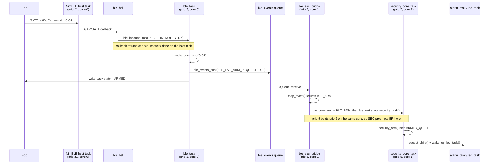

# BLE ↔ Security Core Integration

How a button press on the fob becomes a state change in the harness.

This document covers the seam between two subsystems that were built separately:
the **BLE communication task** (`ble/`), which owns the radio link, and the
**Security Core task** (`security_core/`), which owns the arm/disarm state
machine. If you only want to know "how does the fob arm the harness?", read
[The full path, end to end](#the-full-path-end-to-end) and
[Walkthrough A](#walkthrough-a--the-user-presses-arm-on-the-fob).

---

## The short version

The BLE task never calls the Security task, and the Security task never knows
BLE exists. Between them sits a small adapter task, **`ble_security_bridge`**,
which is the only code in the project that talks to both:

```
fob → radio → ble_task → [event queue] → ble_security_bridge → [ble_command + notify] → security_core_task
```

Everything to the left of the bridge speaks in **BLE events** (`ble_event_t`).
Everything to the right speaks in **commands** (`ble_command` + a task
notification). The bridge translates.

---

## Why there is an adapter at all

The two halves were written against different inter-task conventions, and both
are reasonable. Rather than rewrite either, the integration keeps both and
converts between them in one place.

| | BLE subsystem | Security subsystem |
|---|---|---|
| **Convention** | Post a typed struct to a FreeRTOS **queue** | Set a **global**, then **notify** the task |
| **Producer does** | `ble_events_post(KIND, detail)` | `ble_command = X;` then `ble_wake_up_security_task()` |
| **Consumer does** | `xQueueReceive(ble_events_queue(), …)` | `xTaskNotifyWait(…)`, then read the global |
| **Coupling** | Producer doesn't know the consumer | Producer must know the consumer's handle |

The queue style keeps `ble_task` testable with no Security task present — which
is how the BLE half was developed and bench-tested. The global-plus-notify style
is what every other task in the harness already uses (`battery_status_task` wakes
the LED task exactly this way).

Keeping the translation in its own component buys two concrete things:

- **`ble_task.c` did not change during integration**, and still doesn't depend on
  `globals.h`. The BLE subsystem remains independently buildable and testable.
- **`ble_events` stays pure plumbing.** `ble_security_bridge` is the *only*
  component under `ble/` that includes `common/globals.h`. You can see this in
  the `REQUIRES` lines of the two `CMakeLists.txt` files.

---

## The moving parts

| File | Role |
|---|---|
| `ble/ble_hal/ble_hal.c` | The only file that touches NimBLE. Callbacks translate radio events into `ble_inbound_msg_t` and post them. |
| `ble/ble_task/ble_task.c` | Connection state machine. Decides *what happened*; emits `ble_event_t`. Never calls Security. |
| `ble/ble_events/ble_events.c` | The queue itself, plus `ble_events_post()`. No knowledge of Security. |
| **`ble/ble_security_bridge/ble_security_bridge.c`** | **The seam.** Drains the queue, maps events to commands, notifies Security. |
| `common/globals.c` / `globals.h` | Shared state and the notification helpers, including `ble_wake_up_security_task()`. |
| `security_core/security_core_task.c` | Owns `security_state`. Reads `ble_command`, runs the state machine. |

---

## The shared vocabulary

Three things make up the contract. Worth knowing by name.

### 1. `ble_event_t` — what the BLE side emits

Defined in `ble/ble_events/include/ble_events.h`:

```c
typedef struct {
    ble_event_kind_t kind;   /* BLE_EVT_ARM_REQUESTED, BLE_EVT_FOB_OUT_OF_RANGE, … */
    int32_t          detail; /* kind-dependent: a disconnect reason, an RSSI, … */
} ble_event_t;
```

There are eleven `kind`s covering the whole life of the link — connect, disconnect,
pairing, identity check, range, and the three fob commands.

### 2. `ble_command` — what the Security side reads

Defined in `common/include/globals.h`. Only four values exist:

```c
enum BLE_COMMANDS {
    BLE_NO_COMMAND,  /* 0 */
    BLE_ARM,         /* 1 */
    BLE_DISARM,      /* 2 */
    BLE_OOR          /* 3 — out of range */
};

extern enum BLE_COMMANDS ble_command;   /* Owned by the BLE side */
```

Eleven event kinds collapse into three commands. Most BLE events are internal
bookkeeping that Security has no opinion about.

### 3. `ble_wake_up_security_task()` — the doorbell

Also in `globals.c`:

```c
void ble_wake_up_security_task(void)
{
    xTaskNotify(security_core_task_handle, SECURITY_BLE_BIT, eSetBits);
}
```

`SECURITY_BLE_BIT` is bit 1. The Security task blocks on `xTaskNotifyWait()` and
uses the bit to tell *who* woke it — belt detection and the IMU get their own bits
(`SECURITY_BELT_DETECTION_BIT`, `SECURITY_IMU_BIT`), which is why this is
`xTaskNotify` with bits rather than the simpler `xTaskNotifyGive`.

---

## The full path, end to end



Five hops, each with one job:

1. **NimBLE host task → `ble_hal`.** Radio callbacks run on NimBLE's own task at
   priority 21. They do the absolute minimum: fill in a `ble_inbound_msg_t`, post
   it, return. No state machine logic ever runs in a callback.
2. **`ble_hal` → `ble_task`.** Via the inbound queue registered with
   `ble_hal_set_event_sink()`. `ble_task` blocks on this queue with a 20 ms
   timeout (`HOUSEKEEP_MS`); the timeout tick is what drives periodic work like
   RSSI sampling.
3. **`ble_task` → the event queue.** `ble_task` interprets the raw event and
   emits a *decision* — `BLE_EVT_ARM_REQUESTED`, not "a notification arrived".
4. **Queue → `ble_security_bridge`.** The bridge blocks on
   `ble_events_queue()` forever and translates.
5. **Bridge → Security.** Set the global, ring the doorbell.

**Cores matter here.** Steps 1–3 all run on **core 0**; steps 4–5 run on
**core 1**. That split is deliberate (F35): the radio can never delay the
safety-critical chain, because they're on different CPUs.

---

## Event → command mapping

This is `map_event()` in `ble_security_bridge.c`, the whole translation:

| BLE event | → `ble_command` | Reasoning |
|---|---|---|
| `BLE_EVT_ARM_REQUESTED` | `BLE_ARM` | Fob sent opcode `0x01` |
| `BLE_EVT_DISARM_REQUESTED` | `BLE_DISARM` | Fob sent opcode `0x02` |
| `BLE_EVT_FOB_OUT_OF_RANGE` | `BLE_OOR` | Mechanism B — filtered RSSI crossed the far threshold |
| `BLE_EVT_LINK_LOST_SUPERVISION` | `BLE_OOR` | Mechanism A — link dropped and the fob didn't come back |
| `BLE_EVT_SILENCE_REQUESTED` | *(dropped, logged)* | **No `BLE_SILENCE` exists yet** — see [Not wired yet](#not-wired-yet) |
| `BLE_EVT_FOB_IN_RANGE` | *(none)* | Returning does **not** disarm |
| `BLE_EVT_FOB_DISCONNECTED` | *(none)* | Would double-arm — see below |
| `BLE_EVT_FOB_CONNECTED` | *(none)* | Link bookkeeping |
| `BLE_EVT_PAIRING_SUCCEEDED` / `_FAILED` | *(none)* | Pairing bookkeeping |
| `BLE_EVT_IDENTITY_REJECTED` | *(none)* | Rejected peers never get as far as sending commands |

Three of these choices are non-obvious and worth stating plainly.

**Both range mechanisms produce the same command.** Mechanism A (supervision
timeout) and Mechanism B (RSSI) differ in *confidence*, not in what Security
should do — either way the answer is "the user left, auto-arm". The logs already
distinguish which one fired, so collapsing them here loses nothing.

**A bare disconnect is not "the user left".** When the link drops, `ble_task`
starts a 3-second re-acquire grace (`REACQUIRE_GRACE_MS`) and only raises
`BLE_EVT_LINK_LOST_SUPERVISION` if the fob fails to return. Mapping
`FOB_DISCONNECTED` *as well* would arm twice for one departure — once immediately,
once three seconds later.

**Coming back in range does not disarm.** Per the state machine, S0 (Disarmed) is
reachable only by an explicit disarm command from the fob. Walking back toward a
harness that armed itself should not silently unlock it.

---

## Walkthrough A — the user presses ARM on the fob

Starting state: bonded, connected, `security_state == SECURITY_DISARMED` (S0).

**1. The fob notifies.** It writes `0x01` (`QL_CMD_ARM`) to the Command
characteristic. NimBLE's GATT callback in `ble_hal.c` fires on the host task,
packs the opcode into a message, and hands it off via `post_inbound()`:

```c
ble_inbound_msg_t msg = {0};
msg.kind        = BLE_IN_NOTIFY_RX;
msg.conn_handle = event->notify_rx.conn_handle;
os_mbuf_copydata(event->notify_rx.om, 0, n, msg.payload);  /* payload[0] = 0x01 */
…
post_inbound(&msg);
```

`post_inbound()` uses a **zero timeout** and drops with an error if the queue is
full — it runs on the NimBLE host task, which must never block.

**2. `ble_task` wakes** from `xQueueReceive` and routes into `handle_command()`:

```c
case QL_CMD_ARM:
    QL_LOGI("Command RX: ARM (0x%02x)", opcode);
    ble_events_post(BLE_EVT_ARM_REQUESTED, 0);
    ble_hal_write_state(s_conn_handle, QL_STATE_ARMED);   /* fob's LED (F17) */
    break;
```

Two things happen: the event goes out to Security, and the fob is told the new
state so its confirmation LED can light. (Those are independent — see the caveat
in [Not wired yet](#not-wired-yet).)

**3. `ble_events_post()`** drops the event on the queue with a **zero timeout**.
If Security were wedged and the queue full, the event is logged and dropped
rather than blocking the radio task. A stalled `ble_task` would be much worse
than a lost event.

**4. The bridge wakes** on core 1, maps the event, and publishes:

```c
ble_command = BLE_ARM;
ble_wake_up_security_task();
```

**5. Security preempts immediately.** It's priority 5 on the same core as the
bridge's priority 2, so `xTaskNotify` causes an instant context switch — the
bridge doesn't get another instruction until Security blocks again. This matters;
see [The `ble_command` race](#the-ble_command-race).

**6. `security_core_task` runs.** It returns from `xTaskNotifyWait()` with bit 1
set, sees `security_state == SECURITY_DISARMED`, and dispatches on `ble_command`:

```c
case BLE_ARM:
    arm_test();
    security_arm();
    break;
```

**7. `security_arm()` transitions the machine** — S0 → S1 (Armed, Quiet) — and
notifies the output tasks. Note the guard: arming is only meaningful *from*
disarmed, so an ARM command against an already-armed harness does nothing.

```c
if (prev_security_state == SECURITY_DISARMED) {
    security_state = SECURITY_ARMED_QUIET;
    // TODO: Wake up Belt Detection task
    // TODO: Wake up IMU task
    request_chirp();        /* → alarm_task: confirmation beep */
    wake_up_led_task();     /* → led_task: LED on */
}
```

**8. The output tasks react.** `led_task` wakes, reads `security_state` and
`battery_state`, and drives GPIO 2. `alarm_task` wakes with `ALARM_CHIRP_BIT` set
and chirps.

The serial log for the whole sequence (timestamps illustrative):

```
I (18342) ble_task:      Command RX: ARM (0x01)
I (18342) ble_events:    -> Security: ARM_REQUESTED (detail=0)
I (18343) ble_sec_bridge: ARM_REQUESTED (detail=0) -> ble_command=1, Security notified
```

---

## Walkthrough B — the user walks away

There are two independent detectors, and they fire in different circumstances.

### Mechanism B: the signal fades (fob still connected)

Once per second (`RSSI_SAMPLE_MS`), `housekeeping_tick()` in `ble_task.c` samples
RSSI and runs it through the `proximity` module — an exponential moving average
(`RSSI_ALPHA = 0.15`) feeding a hysteresis band:

- Filtered RSSI drops below **−74 dBm** (`OUT_THRESHOLD_DBM`) → `PROX_WENT_OUT`
- Filtered RSSI rises above **−70 dBm** (`IN_THRESHOLD_DBM`) → `PROX_CAME_IN`

The 4 dB gap between the two thresholds is what stops a fob sitting near the
boundary from flapping between armed and disarmed.

```
I (43120) ble_task: RSSI raw=-77 dBm filt=-74.6 dBm (~5.4 m)
W (43120) ble_task: filtered RSSI crossed OUT threshold (-74 dBm)
I (43121) ble_events: -> Security: FOB_OUT_OF_RANGE (detail=-74)
I (43121) ble_sec_bridge: FOB_OUT_OF_RANGE (detail=-74) -> ble_command=3, Security notified
```

Security, still in S0, treats `BLE_OOR` exactly like an arm request:

```c
case BLE_OOR:
    arm_test();
    security_arm();
    break;
```

If the harness were *already* armed, `BLE_OOR` hits a `break` and nothing happens —
walking further away from an armed harness is not an event.

### Mechanism A: the link dies (fob out of radio range entirely)

The connection supervision timeout expires. `ble_hal` reports the raw disconnect
reason `0x0208` (`BLE_ERR_CONN_SPVN_TMO`) — the authoritative "user left" signal
per F22. `ble_task` then:

1. Posts `BLE_EVT_FOB_DISCONNECTED` (which the bridge ignores)
2. Starts a **3-second** re-acquire grace (`REACQUIRE_GRACE_MS`) and resumes scanning
3. If the fob reconnects in that window, nothing further happens — this absorbs
   dead spots and brief interference
4. If the grace expires, posts `BLE_EVT_LINK_LOST_SUPERVISION`

```
W (51002) ble_task: disconnected (reason=0x0208, was CONNECTED, SUPERVISION TIMEOUT)
I (51002) ble_events: -> Security: FOB_DISCONNECTED (detail=520)
I (51003) ble_sec_bridge: FOB_DISCONNECTED (detail=520): no Security command
W (54010) ble_task: re-acquire grace elapsed without reconnect -> LINK_LOST
I (54010) ble_events: -> Security: LINK_LOST_SUPERVISION (detail=0)
I (54011) ble_sec_bridge: LINK_LOST_SUPERVISION (detail=0) -> ble_command=3, Security notified
```

That middle line — `no Security command` — is the double-arm prevention working.

---

## Walkthrough C — disarming an active alarm

Starting state: `SECURITY_ARMED_TIER3` (S3), alarm sounding, belt was cut.

The fob sends `0x02`. The path is identical to Walkthrough A up to the bridge,
which publishes `BLE_DISARM`. Security sees an armed state this time, so it takes
the other branch of the dispatch and calls `security_disarm()`:

```c
enum SECURITY_STATE prev_security_state = security_state;
security_state = SECURITY_DISARMED;

if (prev_security_state == SECURITY_ARMED_TIER2 ||
    prev_security_state == SECURITY_ARMED_TIER3) {
    wake_up_alarm_task();   /* alarm reads the new state and shuts up */
}

if (prev_security_state == SECURITY_ARMED_QUIET ||
    prev_security_state == SECURITY_ARMED_TIER2 ||
    prev_security_state == SECURITY_ARMED_TIER3) {
    wake_up_led_task();
}
```

Note the pattern used throughout: **the notification carries no data**. Security
updates `security_state` *first*, then wakes the output task, which reads the
global and decides for itself. `alarm_task` sees `SECURITY_DISARMED` and drives
the alarm off. This is the same shape as the BLE→Security hop, one layer down.

Also note what `security_arm()` does *not* do: if the harness is already armed, an
ARM command is a no-op — it deliberately will not silence an active alarm by
re-arming.

---

## The `ble_command` race

`ble_command` is a single global with no mutex. Two events arriving close
together could, in principle, overwrite it before Security reads the first — the
harness would silently ignore a fob command.

This is closed by **placement**, not by locking:

| Task | Priority | Core |
|---|---|---|
| `security_core_task` | **5** | 1 |
| `ble_sec_bridge` | **2** | 1 |

Same core, and the bridge is lower priority. So `ble_wake_up_security_task()`
preempts the bridge on the spot: Security runs, consumes `ble_command`, and
blocks again *before* the bridge is scheduled to handle the next event. The
window in which a second write could land never opens.

**This is why `BLE_SECURITY_BRIDGE_PRIO` and `BLE_SECURITY_BRIDGE_CORE` in
`ble/config/include/config.h` are correctness constraints, not tuning knobs.**
Moving the bridge to core 0, or raising it to priority ≥ 5, makes the two tasks
genuinely concurrent and reintroduces the bug — which would present as *"the
harness occasionally ignores the fob"*: rare, timing dependent, and thoroughly
unpleasant to debug.

If a future design genuinely needs multiple commands in flight, replace the
global with a queue. Don't relax the placement.

---

## Boot order

`app_main()` in `main/main.c` composes the system in a specific order, and two of
the steps have hard dependencies:

```
1. ble_events_init()            create the queue before anything can post to it
2. create the four app tasks    ← populates security_core_task_handle
3. ble_hal_init()               NVS + NimBLE host
4. ble_security_bridge_start()  ← needs (1) and (2)
5. ble_task_start()             starts after the bridge, so no event sits unattended
6. ql_console_start()           bring-up console on the UART
```

Step 4 depends on step 2 because the bridge notifies `security_core_task_handle`,
which `xTaskCreatePinnedToCore()` fills in. `ble_security_bridge_start()` checks
both dependencies and returns `ESP_ERR_INVALID_STATE` rather than notifying a
NULL handle — so a wiring mistake fails loudly at boot instead of silently
dropping every command at runtime.

---

## Not wired yet

Three known gaps, all marked `// TODO(security-core)` in the source.

**1. Silence has nowhere to go.** The fob can send `QL_CMD_SILENCE` (`0x03`), and
`ble_task` raises `BLE_EVT_SILENCE_REQUESTED` — but `enum BLE_COMMANDS` has no
`BLE_SILENCE`, so the bridge drops it with a warning.

> It must **not** be folded into `BLE_DISARM`. Disarm drops the machine to S0;
> silence is meant to quiet the sounder while the harness *stays armed*. Fixing
> it means adding `BLE_SILENCE` to `globals.h` and a case in
> `security_core_task.c`.

**2. The fob's confirmation LED can lie.** `ble_task` writes back the state
*implied* by the command (ARM → `QL_STATE_ARMED`), not the state Security actually
reached. Since `security_arm()` is a no-op when already armed, the fob can be told
"ARMED" for a command that changed nothing. Closing this means having the bridge
write back the confirmed `security_state` after Security acts.

**3. Tier 2 is unreachable.** `security_tier2()` exists but nothing calls it —
the S1 → S2 transition (`>0.5 g for 1 s` or `displacement >30 cm`) needs the IMU
task, which isn't built. This is the source of the one build warning
(`'security_tier2' defined but not used`); it's an accurate signal, left in place
deliberately.

---

## Verifying it on hardware

```bash
. $HOME/.espressif/v6.0/esp-idf/export.sh
idf.py build && idf.py -p PORT flash monitor      # exit: Ctrl-]
```

Filter for the three tags that trace the whole path — `ble_task`, `ble_events`,
`ble_sec_bridge`. A working arm looks like the three-line sequence in
[Walkthrough A](#walkthrough-a--the-user-presses-arm-on-the-fob).

**Testing range without walking around:** the bring-up console exposes an RSSI
override, so Mechanism B can be exercised at a desk:

```
rssi -80      # force filtered RSSI down; should trip OUT after a few samples
rssi clear    # back to the real radio
status        # shows state, bond count, filtered RSSI, and any active override
```

The override runs through the *real* EMA and the *real* thresholds — only the
sample source changes. It logs at warning level, and appears in `status`, because
a forgotten override makes every later range test lie.

Note that this tests the *decision logic*, not the path-loss constants
(`RSSI_C_DBM`, `RSSI_N`), which are still at their untuned defaults. A real walk
test is the only thing that validates those.

---

## See also

- `docs/ble_subsytem.md` — the BLE subsystem in depth: connection state machine,
  GATT contract, pairing, configuration reference
- `extras/BLE_CONTRACT.md` — the wire protocol; wins over every other document
- `extras/HARNESS_BLE_TASK.md` — the BLE task's original design rationale
- `CLAUDE.md` — repo conventions and invariants
